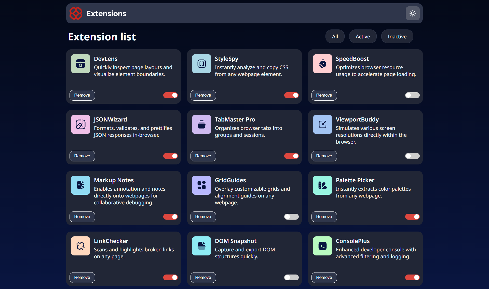

# Frontend Mentor - Browser extensions manager UI solution

This is a solution to the [Browser extensions manager UI challenge on Frontend Mentor](https://www.frontendmentor.io/challenges/browser-extension-manager-ui-yNZnOfsMAp). Frontend Mentor challenges help you improve your coding skills by building realistic projects. 

## Table of contents

- [Overview](#overview)
  - [The challenge](#the-challenge)
  - [Screenshot](#screenshot)
  - [Links](#links)
- [Project Situation](#project-situation)
  - [Built with](#built-with)
  - [What I learned](#what-i-learned)
- [Author](#author)

## Overview

### The challenge

Users should be able to:

- Toggle extensions between active and inactive states
- Filter active and inactive extensions
- Remove extensions from the list
- Select their color theme
- View the optimal layout for the interface depending on their device's screen size
- See hover and focus states for all interactive elements on the page

### Screenshot

### Links

- Solution URL: [Solution Site](https://github.com/Avantiermv/browser-extensions-manager-ui-main)
- Live Site URL: [Live Site](https://avantiermv.github.io/browser-extensions-manager-ui-main/)

## Project Situation 

- [x] Cards - Dark Mode - Style
- [x] Cards - Light Mode - Style
- [x] Cards - Remove Button - Logic
- [x] Cards - Switch Inactive/Active - Logic
- [x] Toggles - Show Active, Inactive, All extensions - Logic

### Built with

- Semantic HTML5 markup
- CSS custom properties
- Flexbox
- CSS Grid
- Mobile-first workflow
- ES6 Modules 

### What I learned
In this challenge, I focused on learning how to use the terminal more for commits, using modules, and changing themes, such as dark mode and light mode.

## Author

- Frontend Mentor - [@Avantiermv](https://www.frontendmentor.io/profile/Avantiermv)
- E-mail - [marcosvinicius](marcosviniciussilvacolares@gmail.com)

